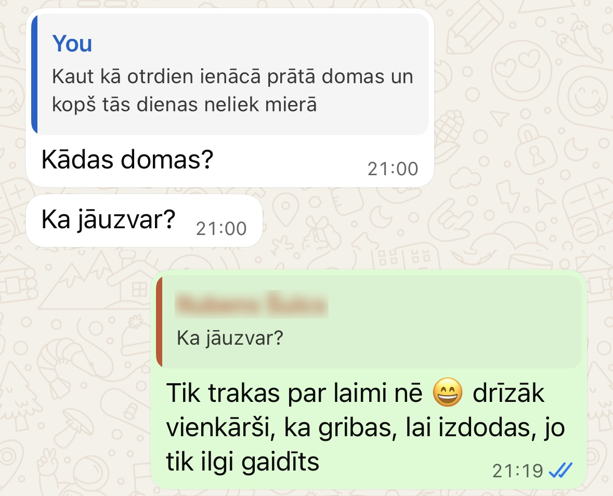
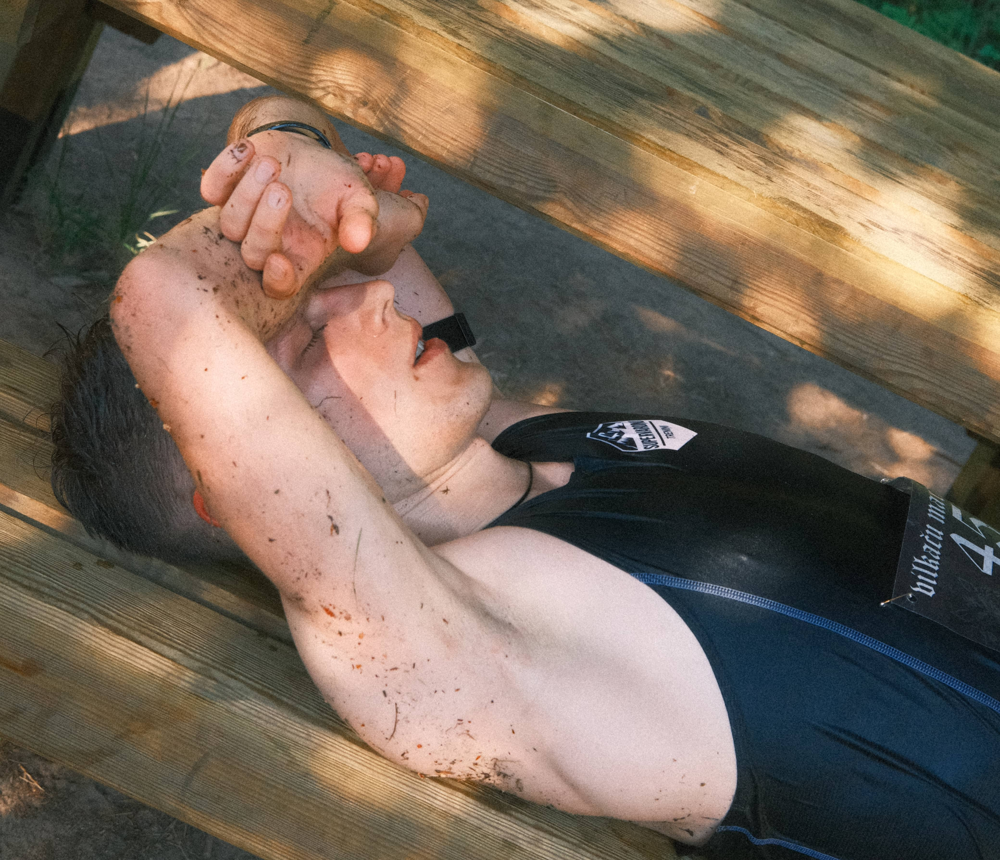
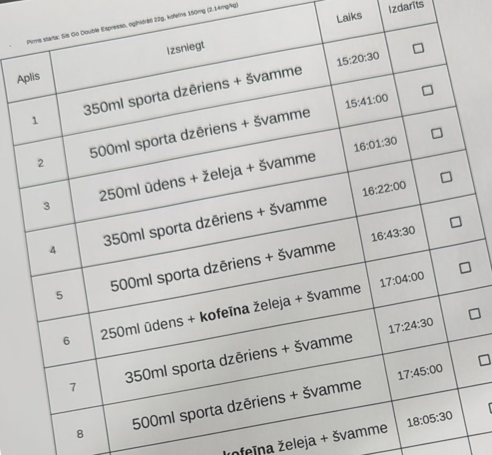

## Sacensību gaita

Viens no galvenajiem padomiem, ko saņēmu, bija nepārķert startu. Man kā hroniskam savu spēju optimistam un nosacītam skriešanas iesācējam tas diezgan reti izdodas. Tomēr saraustīts treniņu process, stipra konkurence un neziņa par to, kā varētu izvērsties mans līdz šim garākais un kalnainākais skrējiens, palīdzēja entuziasmu pieslāpēt un uz startu devos ar sajūtu, ka sacenšos tikai ar sevi.

Līdz pat kādam 6. aplim tā arī bija. Viss mans fokuss bija veltīts uzturam un sacensību mērķim - 20:30 apļa laiki. Tas atstātu nelielu rezervīti, lai finišētu ap 4h30m un attiecīgi izpildītu izlases atlases minimālo kritēriju. Nemaz nedomājot par uzvaru, šis jau likās kā ambiciozs vai pat nedaudz absurds mērķis, jo visu laiku labāko rezultātu tabulā bija stiprāki skrējēji ar lēnākiem laikiem.

Pat ar ļoti apzinātu cenšanos un sevis bremzēšanu, tāpat pirmo apli noskrēju minūti ātrāk (19:29). Toties nākamajā nokalibrējos un sanāca gandrīz perfekti pēc plāna (20:22). Trešajā kājas atkal nedaudz aizgāja brīvsolī (19:52) un pēc šī nolēmu, ka vienkārši ļaušos ātrākam tempam. Jutos labi un arī pulss bija mierīgs. Kāpēc gan ne?

Šeit ar mierīgu pulsu es domāju tādu, kas ir zemāks kā Stirnu Bukā. Loģika pavisam vienkārša - ja SB pēc aptuveni 2h ar vidējo 170bpm esmu diezgan beigts, tad šeit uz 4h+ vajadzētu zemāku. Pēc sajūtām izvēlējos 160bpm, bet nekāda dziļāka doma izvēlei nebija. Šim slieksnim tad arī centos nekāpt stipri pāri.
 
Kad pienāca 6. aplis, sāku panākt skrējējus, kuriem noteikti bija jābūt diezgan tuvu priekšgalam. Vēl arī cilvēki apkārt sāka saukt, ka līderi tepat vien iet. Līdz ar šo tiku izmests no sava burbuļa un attiecīgi arī sākotnējais plāns. To aizstāja uz adrenalīnu balstīta improvizācija.

Pienāca 8. aplis, kur Krampju kalnā izvirzījos vadībā. Es būtu varējis palikt kādu laiku ar tā brīža līderi, bet biju pārāk sapriecājies un nolēmu vienkārši maukt tālāk. Apļa beigās paskatoties pulkstenī (18:34), uzreiz sapratu, ka esmu pārcenties. Ne tikai tas, bet arī mana komanda nebija mani gaidījusi tik ātri, tāpēc nesaņēmu dzeramo uz nākamo apli. 

Jau pavisam drīz 10. aplī jutu sekas. Doma par velšanos pāri Krampju un Spīganu kalniņu duetam vēl 3 reizes likās ārkārtīgi nomācoša. Ja iepriekš mani uz priekšu dzina azarts, tad no šī brīža tās bija bailes un izmisums. Bija sajūta, ka lieliski un apdomīgi iesāktā diena tiks pēdējos apļos izmesta vējā pilnīgi liekas sapriecāšanās dēļ. Skats kā man paskrien garām pēdējos apļos (vai pat metros) dzīvoja mana galvā bez īres maksas līdz pat pēdējam līkumam. Pamazām lūzu nost, tomēr beigās viss sagāja.

Pēc finiša es sāku justies arvien sliktāk. Intervijā knapi reģistrēju jautājumus un piepūlēju visas pieejamās smadzeņu šūnas, lai mēģinātu kaut ko atbildēt. Tirpa seja, vēlāk arī vēders un nevienā pozā nevarēju rast mieru. Biju ļoti pārkarsis. Par laimi man bija līdzi sava ledus kaste ar ūdeni un apkārt bija cilvēki, kas varēja palīdzēt atdzesēties. Liels paldies par to! Ceļā uz mājām vēl divreiz izvēmos un pa nakti nogulēju nieka 4h. Par laimi pēc tam atkopšanās noritēja diezgan raiti un jau 2. nedēļā pēc Vilkača aizvadīju ļoti labu 10h treniņu nedēļu.

## Gatavošanās

Kā jau minēju iepriekš, treniņu process bija saraustīts. Ziemā apjoms bija labs un spēka treniņi arī, bet aukstās ziemas dēļ nekas no tā nenāca viegli un reti kad pašam sagādāja prieku. Līdz ar pirmajām pavasara pazīmēm satraumēju pēdu un pa visu aprīli noskrēju vien 66km. Nemelošu, ka jutos ārkārtīgi nomākts par traumu pie pirmajiem apstāķļiem, kuros skriet ir patīkami. Par laimi viss velo ekipējums man jau ir un varēju viegli pārslēgties uz to. Sanāk, ka skriešana bija ļoti maz, bet kopējais treniņu apjoms tāpat turējās ap ierastajām 10h.

Es patiesībā biju ļoti pārsteigts, cik strauji progresēju uz velo vien dažu nedēļu laikā. Man izdevās pārspēt vairākus savus jaudas rekordus šķietami parastos intervālu treniņos, lai gan pirms skriešanas velo bija mans galvenais sports. Tieši šis progress saglabāja cerību, ka pa dažām kvalitatīvām nedēļām paspēšu saspicēties arī Vilkaču maratonam.

Normāla skriešana atsākās tikai maijā. Pa šo mēnesi paspēju dažas reizes aizbraukt uz Siguldu paskriet pa Pilsētas trasi, noskriet lūša distanci Augstrozes Stirnu Bukā un nedēļu pirms Vilkaču maratona izskriet 6 apļus pa sacensību trasi. Visi šie treniņi bija ārkārtīgi vērtīgi:

- Pilsētas trase bija sezonas uguns kristības augšstilbiem, kas pēc tam bija stīvi pilnu nedēļu.
- Stirnu Buka intensitāte atgrieza manu tempu tuvu līmenim, kāds bija pirms slimošanas.
- Trases izpēte ļāva vismaz nedaudz nokalibrēties un saprast, kas mani sagaida.

Kaut kur pa vidu šim visam vēl bija nedēļa ar pasīvajiem karstuma treniņiem, kas izpaudās kā 20min vannas +40-42 grādos katru dienu.

Pašā sacensību dienā man palīdzēja divi draugi. Viens ar filmēšanu un viena ar uzturu un vēsa ūdens švammes padošanu sacensību centrā, lai man nebūtu ne reizi jāapstājas. Biju izprintējis lapu ar tabuliņu, kur rakstīts, ko padot katrā aplī, lai palīgam vieglāk. Pēc plāna vidēji stundā būtu sanācis 1L ūdens, 95g ogļhidrāti, 450mg nātrijs un katru otro stundu 100mg kofeīns. Lielākā daļa ogļhidrātu sporta dzērienā, tikai reizi trīs apļos pa želejai. Viena nātrija tablete aplī izkrita, dažas želejas neapēdu un vienu ūdens pudelīti nesanāca padot, tāpēc beigās uzņēmu mazāk.

## Mācības un atziņas

Lai gan finišā jutos izžmiedzis no sevis visu, ātri vien identificēju vairākas lietas, kas palīdzētu sniegumu uzlabot:

- **Vienmērīgāks temps**: Mans vidējais apļa laiks bija 19:57, be tikai 5 apļus es noskrēju lēnāk. Tas nozīmē, ka šajos 5 zaudēju tik pat, cik ieguvu 8 ātrākos apļos. Ja ātrākie nebūtu bijuši tik ātri, arī lēnākie nebūtu tik lēni. Šādi pat ar identisku rezultātu drošvien finišā būtu juties labāk.
- **Treniņi trasē**: Trase ir tik specifiska Latvijas kontekstā, ka vienīgais veids, kā tiešām saprast savu tempu, ir braukt skriet apļus treniņos. Vismaz vienreiz atbraukt noderētu ikvienam. Tiem, kas iet uz rezultātu, kā galveno treniņu dažas nedēļas iepriekš ieteiktu 4-6 apļus pamīšus ātri/lēni un pa vidu tiem vēl 2-3x reizes augšā lejā Spīganu kalnā. Laba simulāciju kāju nogurumam, nepārspīlējot ar kopējo slodzi.
- **Vēl vairāk dzert**: Šoreiz man sanāca ap 900ml/h, bet nākamreiz ietu uz vismaz 1.2L/h. Šeit gan nedaudz arī manis paša specifika. Esmu mērījis, ka aktīvi skrienot pa kalnu siltā laikā izsvīstu 2L/h. Tas ir daudz, bet var būt arī vairāk. Visu izdzert atpakaļ nav reāli, bet tiekties uz to nav slikta doma, jo dehidratācija ļoti strauji nokauj sniegumu. Tieši tāpēc ieteiktu ikvienam dažādos apstākļos nosvērties bez drēbēm pirms un pēc treniņa, lai saprastu, cik daudz tieši jūs izsvīstat, un tālāk vadīties pēc tā.
- **Nekādu želeju**: Labi, varbūt pirmajos dažos apļos vēl var, bet pēc pirmās puses es vairs nevarēju apsmadzeņot domu par želeju. Saldais sporta dzēriens gan viegli gāja iekšā, tāpēc kopā ar iepriekšējo punktu liktu lielāku uzsvaru uz to. Kofeīnam varētu izmēģināt kofeīna tabletes.
- **Ledus veste**: Labprāt izmēģinātu pieguļošu vesti, kur muguras nodalījumā tuvu kaklam ielikts dzesējošs elements. Tā vietā, lai uz mirkli atsvaidzinātos sacensību centrā, varētu visu apli skriet ar kaut ko dzesējošu.
- **Nūjas**: Ja es kaut 5% no tā, kā jutās manas kājas pēdējos apļos, būtu varējis pārnest uz rokām, es būtu varējis noskriet ātrāk. Šoreiz to nedarīju, jo man vienkārši nav nūju un nekad ar tām neesmu skrējis. Būtu jāpamācās. Vienīgi pagaidām nav skaidrs, ko tad darītu ar ūdeni, jo skriet ar pudelīti rokās bija ļoti ērti.
- **Lielāka atbalsta komanda**: Šī jau ļoti specifiska detaļa, bet, katra dzimuma top skrējējiem noderētu atbalsta cilvēks gan sacensību centra sākumā, gan beigās. Pirmais padod želeju vai dzeramo, ko līdz otram paspēj notiesāt. Otrs padod minimālo nepieciešamo trasē. Ja 2x sanāk uzliet virsū aukstu ūdeni, tad vispār ideāli. Manuprāt, ir starpība startā izdzert 250ml un iziet trasē ar 250ml vai iziet trasē ar 500ml.

Kopumā Vilkaču maratons mani ļoti iedvesmoja un es labprāt atgrieztos. Pagaidām gan grūti teikt, vai tas būs nākamgad. Atkarīgs no izlases atlases procesa. Ja nākamgad Vilkacis būs līdzīgos datumos, tad tas jau būs par vēlu, lai punktus pieskaitītu kvalifikācijai. Ja man būs izredzes un cīņa par vietām būs sīva, tad prioritāti došu citām sacensībām.
